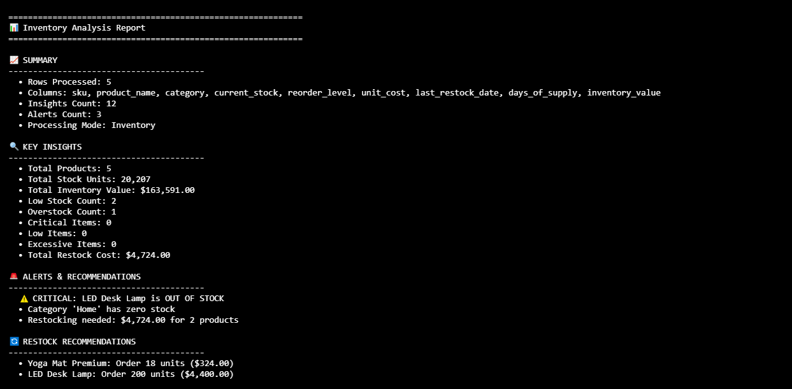
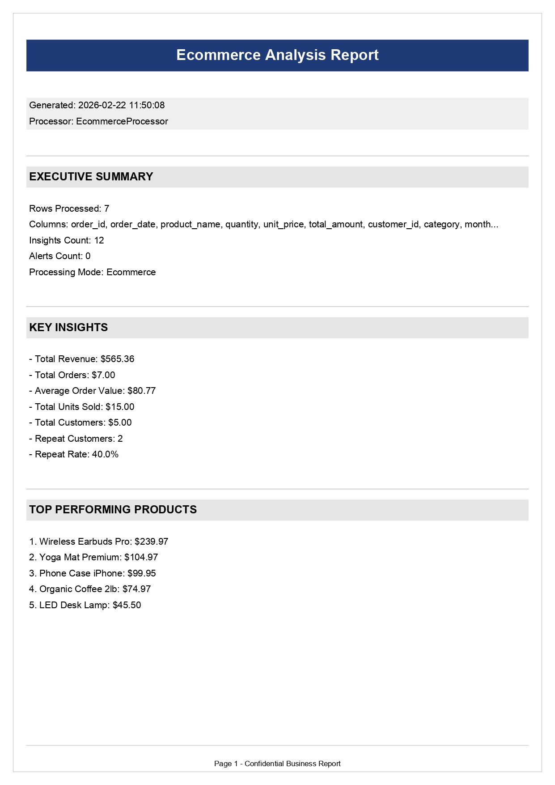

# CSV Business Processor

[](https://python.org)
[](https://github.com/Abdullah-Ahmadi/csv-business-processor)
[](LICENSE)
[](https://github.com/psf/black)
[](https://github.com/Abdullah-Ahmadi/csv-business-processor/graphs/commit-activity)

**A professional command-line tool that transforms raw business CSV files into actionable insights.**  
Built for e-commerce sellers, inventory managers, and business owners who need data-driven decisions without complex software.

---

## 📋 Table of Contents

- [The Problem](#the-problem)
- [The Solution](the-solution)
- [Features](#features)
- [Quick Start](#quick-start)
- [Installation](#installation)
- [Processing Modes](#processing-modes)
- [Output Formats](#output-formats)
- [Logging](#logging)
- [Contributing](#contributing)
- [About the Author](#about-the-author)

---

## The Problem

Businesses today drown in CSV files:

- **E-commerce sellers** juggle sales reports, inventory lists, and customer data across multiple platforms
- **Warehouse managers** struggle to track stock levels and know when to reorder
- **Small business owners** export expense reports but can't extract meaningful insights
- **Hours wasted** manually copying data into Excel for basic analysis
- **Missed opportunities** due to lack of timely business intelligence

---

## The Solution

**CSV Business Processor** bridges the gap between raw data and actionable insights:

- **No API keys required** — Works with files you already have
- **Three specialized modes** — E-commerce, Inventory, and Finance
- **Four output formats** — Console, Excel, JSON, and PDF
- **Production-ready** — Comprehensive logging, error handling, modular design

---

## Features

### Smart CSV Processing
- **Automatic structure detection** — Leverages pandas to intelligently parse CSV files regardless of formatting variations
- **Column standardization** — Recognizes and normalizes common column name variations (e.g., "order_id", "orderid", "Order ID")
- **Robust error handling** — Comprehensive try-except mechanisms with detailed logging ensure stability

### Three Specialized Processing Modes

| Mode | Input Data | Business Insights |
|:-----|:-----------|:------------------|
| **E-commerce** | Sales transactions | Revenue metrics, top products, category performance, repeat customer rates, monthly growth trends |
| **Inventory** | Stock levels | Current stock, critical alerts, low stock warnings, overstock identification, restock recommendations with cost estimates |
| **Finance** | Expense records | Category breakdown, payment method analysis, monthly trends, large transaction detection, savings opportunities |

### Four Export Formats
- **Console** — Human-readable terminal output for quick insights
- **Excel** — Multi-sheet formatted workbooks with color-coded alerts
- **JSON** — Structured data for further processing or integration
- **PDF** — Professional printable reports suitable for stakeholders

### Production-Ready Architecture
- **Comprehensive logging** — Every execution creates a timestamped log file
- **Modular design** — Easy to extend with new processors or exporters
- **Cross-platform** — Works on Windows, macOS, and Linux
- **Well-tested** — Unit tests ensure reliability

---

## Quick Start

```bash
# 1. Clone the repository
git clone https://github.com/Abdullah-Ahmadi/csv-business-processor.git
cd csv-business-processor

# 2. Install dependencies
pip install -r requirements.txt

# 3. Run with sample e-commerce data
python -m csv_processor sample_data/ecommerce.csv --mode ecommerce --output console

# 4. Generate an Excel inventory report
python -m csv_processor sample_data/inventory.csv --mode inventory --output excel

# 5. Create a PDF expense report
python -m csv_processor sample_data/expenses.csv --mode finance --output pdf
```

---

## Installation
### Prerequisites
- Python 3.8 or higher

- pip package manager

### Option 1: Install from Source
```bash
# Clone the repository
git clone https://github.com/Abdullah-Ahmadi/csv-business-processor.git
cd csv-business-processor

# Install dependencies
pip install -r requirements.txt

# Optional: Install in development mode
pip install -e .
```
### Option 2: Use as a Package
```python
# Import directly into your Python projects
from csv_processor.processors import EcommerceProcessor
from csv_processor.exporters import ExcelExporter

# Use the components in your own code
processor = EcommerceProcessor()
processor.load_data("sales.csv")
processor.analyze()

exporter = ExcelExporter()
exporter.export(processor, "report.xlsx")
```

---

## Usage Guide
### Command Line Syntax
```bash
python -m csv_pro.cli <input_file> --mode <mode> --output <format> [options]
```
### Arguments

| Argument    | Short | Description                                           | Required | Default        |
|-------------|-------|-------------------------------------------------------|----------|----------------|
| input_file  | -     | Path to your input CSV file                           | Yes      | -              |
| --mode      | -m    | Processing mode: ecommerce, inventory, finance        | Yes      | -              |
| --output    | -o    | Export format: console, json, excel, pdf              | Yes      | -              |
| --outfile   | -f    | Output file path (auto-generated if not provided)     | No       | Auto-generated |
| --verbose   | -v    | Show detailed processing information                  | No       | False          |

### Auto-generated Filenames
If you don't specify an output file with --outfile, the program generates a filename containing:

- Processing mode

- Timestamp

- Appropriate extension

Example: ecommerce_report_20260314_110845.xlsx

---

## Processing Modes
### E-commerce Mode
Analyzes sales data to reveal business performance metrics.

#### Generated insights:

- Total revenue and average order value

- Top 5 products by revenue

- Category performance breakdown

- Customer repeat rate

- Monthly growth trends

- Sales alerts (declines, spikes)

Example:

```bash
python -m csv_pro.cli sales.csv --mode ecommerce --output excel --outfile sales_analysis.xlsx
```

### Inventory Mode
Monitors stock health and provides restocking recommendations.

#### Generated insights:

- Total inventory value

- Critical items (out of stock)

- Low stock alerts (<7 days supply)

- Overstock identification

- Restock recommendations with quantities and costs

- Category stock distribution

Example:

```bash
python -m csv_pro.cli inventory.csv --mode inventory --output pdf --outfile stock_report.pdf
```

### Finance Mode
Tracks expenses and identifies spending patterns.

#### Generated insights:

- Total spending by category

- Payment method analysis

- Monthly spending trends

- Large transaction detection

- Average transaction values

- Savings opportunities

Example:

```bash
python -m csv_pro.cli expenses.csv --mode finance --output json --outfile budget.json
```

---

## Output Formats
### Console Output
Quick, human-readable insights directly in your terminal with color-coded formatting.

``` bash
python -m csv_pro.cli data.csv --mode ecommerce --output console
```
<div align="center">
  
  <p><em>Console output showing real-time insights</em></p>
</div>

### Excel Export
Multi-sheet formatted workbooks with color-coded alerts and professional styling.

```bash
python -m csv_processor data.csv --mode inventory --output excel
```

<div align="center">
  
  <p><em>Excel output showing category analysis</em></p>
</div>


#### Sections included:

| Sheet Name              | Description                                         |
|--------------------------|-----------------------------------------------------|
| Executive Summary        | Key metrics and alerts at a glance                  |
| Inventory Health         | Detailed stock analysis with color coding           |
| Restock Recommendations  | What to order, how much, and estimated cost         |
| Alerts                   | All warnings and critical issues                    |
| Raw Data                 | Original data for reference                         |


#### Color coding:

🔴 Red — Critical (out of stock, <3 days supply)

🟡 Yellow — Warning (low stock, <7 days supply)

🟢 Green — Healthy (optimal stock levels)

🔵 Blue — Informational

### JSON Export
Structured machine-readable data for integration with other tools.

```bash
python -m csv_pro.cli data.csv --mode finance --output json
```

### PDF Export
Professional, printable reports suitable for sharing with stakeholders.

```bash
python -m csv_pro.cli data.csv --mode ecommerce --output pdf
```

<div align="center">
  
  <p><em>PDF output showing a business report</em></p>
</div>

### PDF features:

- Professional cover page with title and timestamp

- Executive summary section

- Key insights with formatted numbers

- Alerts and recommendations

- Page numbers and footer

- Clean, readable typography

---

## Logging
Comprehensive logging ensures you can always debug issues or audit past executions.

### Log Files
```bash
# Every run creates a timestamped log file
logs/csv_processor_YYYYMMDD_HHMMSS.log

# View the latest log
cat logs/csv_processor_*.log | tail -50 ```

### Log Contents
`` text
2024-03-14 15:30:22 - CSVProcessor - INFO - ============================================================
2024-03-14 15:30:22 - CSVProcessor - INFO - CSV PROCESSOR v1.0 - Starting execution
2024-03-14 15:30:22 - CSVProcessor - INFO - ============================================================
2024-03-14 15:30:22 - CSVProcessor - INFO - Input file: sample_ecommerce.csv
2024-03-14 15:30:22 - CSVProcessor - INFO - Mode: ecommerce
2024-03-14 15:30:22 - CSVProcessor - INFO - Output format: excel
2024-03-14 15:30:22 - EcommerceProcessor - INFO - Loading e-commerce data from sample_ecommerce.csv
2024-03-14 15:30:22 - EcommerceProcessor - INFO - Loaded 42 rows with 7 columns
2024-03-14 15:30:22 - EcommerceProcessor - INFO - Starting analysis
2024-03-14 15:30:22 - EcommerceProcessor - WARNING - Alert 1: Sales declined 12% from previous month
2024-03-14 15:30:22 - EcommerceProcessor - INFO - Analysis complete: 8 insights, 2 alerts
2024-03-14 15:30:22 - ExcelExporter - INFO - Starting Excel export for EcommerceProcessor
2024-03-14 15:30:23 - ExcelExporter - INFO - Excel export completed: ecommerce_report_20240314_153022.xlsx
2024-03-14 15:30:23 - CSVProcessor - INFO - Processing completed successfully
```

### Verbose Mode
Use --verbose or -v to see detailed progress in the console:

```bash
python -m csv_processor data.csv --mode ecommerce --output excel --verbose
```

---

## Contributing
Contributions are welcome! Here's how you can help improve CSV Business Processor:

### Ways to Contribute
- Report bugs — Open an issue with detailed reproduction steps

- Suggest features — Share ideas for new processors or exporters

- Improve documentation — Fix typos, add examples, clarify instructions

- Submit code — Fix bugs or add new features via pull requests

---

## About the Author
Abdulla Ahmadi is a Python developer with a passion for building tools that solve real business problems.

- 💼 Freelance Developer — Specializing in data automation and business intelligence

- 🌍 Based in — Afghanistan, working remotely with clients worldwide

- 🚀 Mission — Build tools that make data accessible to everyone

### Connect
- GitHub: @Abdullah-Ahmadi

- Project Link: https://github.com/Abdullah-Ahmadi/csv-business-processor

- Fiverr: Available for custom automation projects https://www.fiverr.com/s/BRVRNGk


Built with ❤️ for the business owners and beyond

